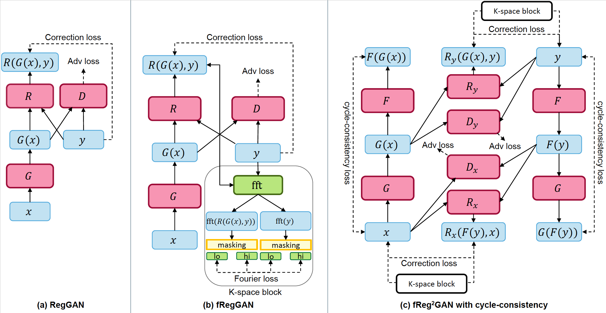

# fRegGAN: K-space Loss Regularization for Medical Image Translation

[](https://github.com/pre-commit/pre-commit)
[](https://pytorch.org/get-started/locally/)
[](https://pytorchlightning.ai/)
[](https://hydra.cc/)
[](https://black.readthedocs.io/en/stable/)
[](https://github.com/pre-commit/pre-commit)

[](https://arxiv.org/abs/2303.15938)

Welcome to the official code repository for the paper "fRegGAN: K-space Loss Regularization for Medical Image Translation". The repository is dedicated to enabling researchers and developers to reproduce the results presented in our paper.

The code present in this repository is maintained by the original authors of the paper and is open to contributions, fixes, and updates from the research community.

Please note, while the preprocessed data is available, the trained models are not part of this repository. The objective of this repository is to facilitate an understanding of our methodology and to allow the research community to reproduce and validate our results.

We sincerely hope that our work contributes to your research, development, and understanding of frequency-regularized generative adversarial networks. Happy coding!



## BibTeX

```bibtex
@article{baltruschat2023freggan,
      title={fRegGAN with K-space Loss Regularization for Medical Image Translation},
      author={Ivo M. Baltruschat and Felix Kreis and Alexander Hoelscher and Melanie Dohmen and Matthias Lenga},
      year={2023},
      eprint={2303.15938},
      archivePrefix={arXiv},
      primaryClass={eess.IV}
}
```

## Getting Started

### Software dependencies

- Conda as environment manager. If not installed, you can download and install [Mamba](https://github.com/conda-forge/miniforge) with the following command:\
  `curl -L -O "https://github.com/conda-forge/miniforge/releases/latest/download/Mambaforge-$(uname)-$(uname -m).sh" && bash Mambaforge-$(uname)-$(uname -m).sh`

- [Poetry](https://python-poetry.org/docs/) as dependency and package manager. If not installed, you can download and install the preview version with:\
  `curl -sSL https://install.python-poetry.org | python3 - --version 1.2.2`

- [WandB](https://www.wandb.com/) as experiment tracking, data versioning. Using wandb requires you to setup an account first. After that just complete the config as below.

### Installation process

First we need to create a conda environment and install all needed packages. This can be done manually or automatically.\\

```bash
conda env create -p "$PWD/.envs/cmrai_py39" --file "$PWD/docker-pytorch/environment.yml"
conda activate "$PWD/.envs/cmrai_py39"
poetry install --no-dev
export WANDB_USER=[YOUR_username]
export WANDB_KEY=[API_KEY]
export WANDB_ENTITY=[YOUR_ENTITY]
dump-env --source=.env.template > .env
```

### Data preparation

We uploaded a preprocessed version of the BraTS2021 dataset to Zenodo [here](https://zenodo.org/record/8141526). 
First, you need to download the data and then unzip the tar.gz file into the folder `data`.

```bash
zenodo_get 8141526
tar -xzvf brats2021_nii.tar.gz -C "$PWD/data"
```

Then run the following commands to prepare the data.

```bash
python cmrai/data/prepare_brats.py
python cmrai/data/process_brats.py --data_dim=2d
python cmrai/data/splitdata_brats.py --data_dim=2d --do_cleaning
```

<br>

## 🚀  Quickstart

```bash
python cmrai/train.py experiment=paper_01_cycle_gan_00.yaml
```

## Resources

This project was inspired by:

- [ashleve/lightning-hydra-template](https://github.com/ashleve/lightning-hydra-template/)
- [PyTorchLightning/deep-learninig-project-template](https://github.com/PyTorchLightning/deep-learning-project-template)
- [drivendata/cookiecutter-data-science](https://github.com/drivendata/cookiecutter-data-science)
- [lucmos/nn-template](https://github.com/lucmos/nn-template)
- [kedro-org/kedro](https://github.com/kedro-org/kedro)

Useful repositories:

- [pytorch/hydra-torch](https://github.com/pytorch/hydra-torch) - safely configuring PyTorch classes with Hydra
- [romesco/hydra-lightning](https://github.com/romesco/hydra-lightning) - safely configuring PyTorch Lightning classes with Hydra
- [PyTorchLightning/lightning-transformers](https://github.com/PyTorchLightning/lightning-transformers) - official Lightning Transformers repo built with Hydra

Other resources:

- [Cookiecutter Data Science Project Structure Opinions](http://drivendata.github.io/cookiecutter-data-science/#opinions)
- [The Machine Learning Reproducibility Checklist](https://www.cs.mcgill.ca/~jpineau/ReproducibilityChecklist.pdf)
